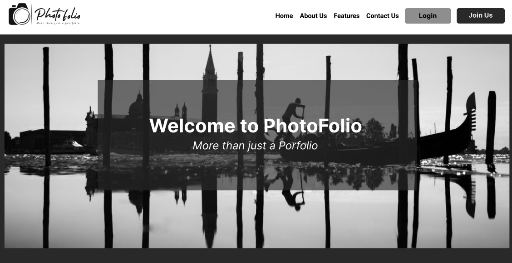
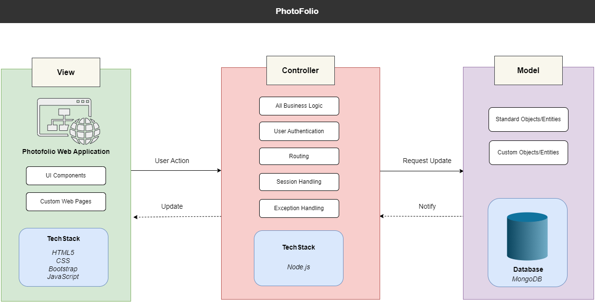
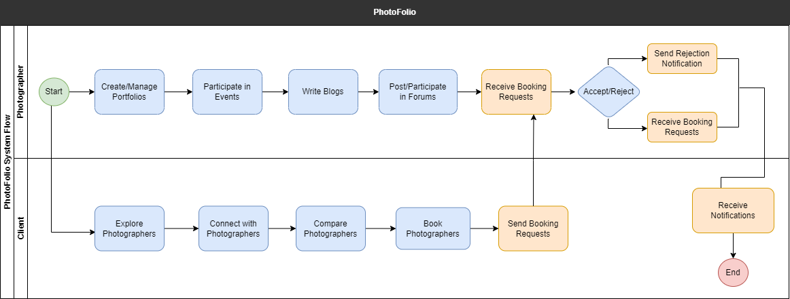

<a name="readme-top"></a>

<!-- PROJECT  -->
<br />
<div align="center">
  <a href="https://github.com/othneildrew/Best-README-Template">
    
  </a>
</div> <br>

<div>
<p> In an era where visual storytelling holds immense importance, professional and amateur photographers require a robust platform to showcase their work, manage their portfolios, and interact seamlessly with their audience.  </p> <br>
</div>

<!-- TABLE OF CONTENTS -->
<details>
  <summary>Table of Contents</summary>
  <ol>
    <li>
      <a href="#about-the-project">About The Project</a>
      <ul>
        <li><a href="#features"> Features</a></li>
        <li><a href="#tech-stack"> Tech Stack </a></li>
      </ul>
    </li>
    <!-- <li>
      <a href="#getting-started">Getting Started</a>
      <ul>
        <li><a href="#prerequisites">Prerequisites</a></li>
        <li><a href="#installation">Installation</a></li>
      </ul>
    </li> -->
    <li><a href="#additional-information">Additional Information</a></li>
    <li><a href="#team">Team</a></li>
    <li><a href="#acknowledgments">Acknowledgments</a></li>
  </ol>
</details>


<!-- ABOUT THE PROJECT -->
## About The Project



<p> The PhotoFolio project aims to develop a comprehensive and user-friendly photography portfolio management system. In an era where visual storytelling holds immense importance, professional and amateur photographers require a robust platform to showcase their work, manage their portfolios, and interact seamlessly with their audience. PhotoFolio stands as an innovative platform designed to revolutionize the way photographers manage their portfolios, engage in competitions, share stories through blogs, and offer specialized services. Clients should easily search, browse, and compare photographers based on style and reviews to find the ideal match for their project or event. <p>

<hr>

### Features

#### Photographers
* Create/Edit Portfolio
* Filter and View Categorical Photos
* Participate in Forum Discussions
* Register for Events/Competitions
* Receive Bookings by Clients
* Create and Publish Blog Posts


#### Clients
* View Portfolios/Blog Posts of Photographers
* Filter and View Categorical Photos
* Communicate Enquiries with Photographers
* Book Photographers for Events


There are heaps of ideas that can be implemented to this project and we'll be adding more features in the near future. You may also suggest some ideas by forking this repo and creating a pull request or opening an issue.


### Tech Stack

This section should list any major frameworks/libraries used to bootstrap your project. Leave any add-ons/plugins for the acknowledgements section. Here are a few examples.

* [Node](https://nodejs.org/en)
* [Mocha](https://mochajs.org/)
* [Chai](https://www.chaijs.com/)
* [NodeMailer](https://nodemailer.com/)
* [GridFS-Stream](https://www.npmjs.com/package/multer/)
* [Multer](https://www.npmjs.com/package/multer/)
* [Bootstrap](https://getbootstrap.com/)
* [JavaScript](https://www.javascript.com/)

#### Database
* [MongoDB](https://www.mongodb.com/)
* [Mongoose](https://mongoosejs.com/)

#### Architecture



#### System Flow



<p align="right">(<a href="#readme-top">back to top</a>)</p>


<!-- GETTING STARTED
## Getting Started

This is an example of how you may give instructions on setting up your project locally.
To get a local copy up and running follow these simple example steps.

### Prerequisites

This is an example of how to list things you need to use the software and how to install them.
* npm
  ```sh
  npm install npm@latest -g
  ```

### Installation

_Below is an example of how you can instruct your audience on installing and setting up your app. This template doesn't rely on any external dependencies or services._

1. Get a free API Key at [https://example.com](https://example.com)
2. Clone the repo
   ```sh
   git clone https://github.com/your_username_/Project-Name.git
   ```
3. Install NPM packages
   ```sh
   npm install
   ```
4. Enter your API in `config.js`
   ```js
   const API_KEY = 'ENTER YOUR API';
   ```

<p align="right">(<a href="#readme-top">back to top</a>)</p> -->


<!-- ADDITIONAL INFO -->
## Additional Information
<div>
    <p> 
        Wireframes: <a href="https://www.figma.com/file/xdLTOkO3XmrFgLct7I6a1J/PhotoFolio"> <strong>  Figma </a> </strong>   <br>
        Project - Git Repository: <a href="https://github.com/likithadt/SIT725-Photofolio"> <strong>  Photofolio </a> </strong> <br>
        Comprehansive Documentation can be accessed <a href="#"><strong> Here </strong></a> <br>
        Take a sneak peak at our work! <a href="#"> <strong>  Check Demo </strong></a> 
    </p>
</div>

<!-- CONTACT -->
## Team

<strong>
<ul>
    <li> LIKITHA DODDAYAGATI THIMMAIAH </li>
    <li> MOHAN SAI KIRAN BONU </li>
    <li> NABIHA MASOOD </li>
    <li> PRASHANT VIJAY PATIL </li>
</ul>
 </strong> 

<!-- ACKNOWLEDGMENTS -->
## Acknowledgments

The following resources has been a great help throughout this project. 

* [Bootstrap](https://pages.github.com)
* [Font Awesome](https://fontawesome.com)
* [Node](https://nodejs.org/en)
* [Mocha](https://mochajs.org/)
* [Chai](https://www.chaijs.com/)
* [NodeMailer](https://nodemailer.com/)
* [GridFS-Stream](https://www.npmjs.com/package/multer/)
* [Multer](https://www.npmjs.com/package/multer/)
* [Bootstrap](https://getbootstrap.com/)
* [JavaScript](https://www.javascript.com/)
* [Figma](http://Figma.com/)

<p align="right">(<a href="#readme-top">back to top</a>)</p>
